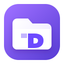

# PDrive Desktop

<p align="center">
  
</p>

<p align="center"><strong>A private, native Proton Drive experience for Linux.</strong></p>

[](https://github.com/alpereneser/pdrive-desktop/actions/workflows/ci.yml)
[](LICENSE)

PDrive Desktop exists because Linux users have Proton's official command-line client but no
matching native desktop interface. It adds a focused GTK/libadwaita experience on top of the
official `proton-drive` CLI without introducing a PDrive account, backend, relay, analytics
service, or password form. It is an early preview and must not be the only copy of important
data.

## What works today

- Sign in through Proton's official browser flow and Linux secret store.
- Browse My files, Computers, shared sections, Photos, and Trash.
- Enter folders with a single click and navigate back safely.
- Create folders and upload files or directories with non-destructive conflict policies.
- Download into a private local staging area, then commit regular files without overwriting
  existing local data or following symbolic links.
- Move remote items to Trash only after explicit confirmation.
- Run a one-way, non-deleting backup with a verification pass.

## What this project deliberately does not do

- It never asks for, receives, or stores a Proton password.
- It has no PDrive cloud service and cannot view users' files remotely.
- It does not collect telemetry, crash reports, filenames, local paths, or usage analytics.
- It does not silently overwrite local files or permanently delete remote files.
- It does not extract Proton CLI sessions for use with an unsupported backend.
- Bidirectional sync and FUSE mounting are not advertised as safe or complete.

## Data flow

```text
User → local GTK app → local official Proton CLI → Proton Drive
                              │
                              └→ Linux secret store (session)

No connection to a PDrive-operated server exists.
```

## Principles

- Credentials never enter this application's process. Authentication is delegated to the
  official CLI and the operating-system secret store.
- Domain and application code do not depend on GTK, subprocesses, or Proton's CLI format.
- Destructive remote operations are denied by default.
- Every CLI operation uses an argument vector (never a shell), a minimal environment,
  bounded output, and a timeout.
- The official binary is not redistributed. Installation will verify Proton's published
  SHA-512 checksum before activation.
- There is no PDrive server and no telemetry. The runtime talks to Proton only through the
  official CLI; decrypted data remains on the user's device.

## Architecture

The project is a modular monolith with process-ready boundaries:

```text
GTK/libadwaita UI -> application use cases -> domain
                              |
                              v
                    DriveGateway protocol
                              |
                              v
                    official CLI adapter
```

This gives DDD/Clean Architecture isolation without adding localhost HTTP services and
extra attack surface to a single-user desktop application. Transfer workers can later be
moved into a sandboxed process without changing the domain or use cases.

## Development

```bash
python3 -m venv .venv
.venv/bin/pip install -e '.[dev]'
.venv/bin/pytest
```

GTK4 and libadwaita are runtime system dependencies for the graphical shell. Core tests
do not require them.

Every pull request must pass tests, linting, strict type checks, secret-pattern checks, and
two reproducible Debian package builds. The protected `main` branch additionally requires a
code-owner review. Releases are created only from an owner-issued version tag whose value
matches `pyproject.toml`.

## Installation and releases

Release packages will be published on the repository's **Releases** page together with a
SHA-256 manifest. Until the first provenance-verified release is published, build from source
or treat locally shared `.deb` files as development previews. PDrive Desktop does not yet
perform automatic privileged updates; that feature remains blocked on end-to-end artifact
authenticity verification.

The current development milestone supports browser authentication, folder navigation,
safe-conflict upload/download, folder creation, and confirmed move-to-trash. Permanent
deletion and bidirectional sync remain disabled until their conflict and recovery tests
are complete.

See [`docs/architecture.md`](docs/architecture.md),
[`docs/threat-model.md`](docs/threat-model.md), and
[`docs/design-language.md`](docs/design-language.md). Planned work and release gates are
tracked in [`docs/roadmap.md`](docs/roadmap.md).

## Privacy and independence

PDrive Desktop is an independent community project and is not affiliated with or endorsed by
Proton AG. Proton and Proton Drive are trademarks of their respective owner. Before reporting
a problem, remove account identifiers, personal file names, file contents, and session data.

## Contributing and security

Contributions are welcome under the [GPL-3.0-or-later license](LICENSE). Read
[CONTRIBUTING.md](CONTRIBUTING.md) before submitting changes. Security vulnerabilities must be
reported privately as described in [SECURITY.md](SECURITY.md), never in a public issue.
